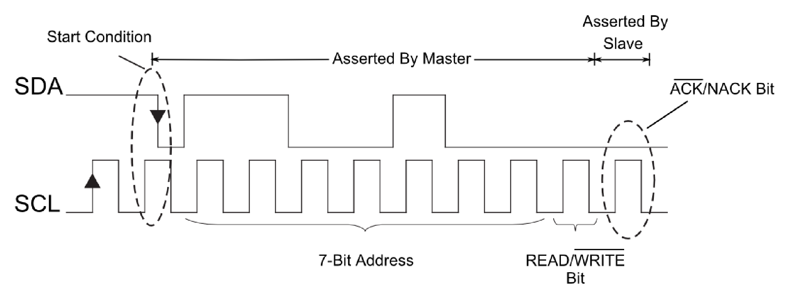

# I2C

## Introduction:

The Inter-Integrated Circuit (I2C) bus is a two wire serial interface originally developed by the Phillips Corporation for use in consumer products. It is a bi-directional bus that is easily implemented in any IC process (NMOS, CMOS, bipolar) and allows for simple inter-IC communication. Connections are minimized by using a serial data line (SDA), a serial clock line (SCL) and a common ground to carry all communications. I2C has gained large acceptance and has even served as a prototype for the System Management Bus (SMBus), which is a subset of I2C.

## Design

I2C communication protocol follows a master/slave hierarchy, wherein the master is defined as the device that clocks the bus, addresses slaves and writes or reads data to and from registers in the slaves. The slaves are devices that respond only when interrogated by the master, through their unique address. Hence it is imperative to avoid duplication of addresses among slaves. Slaves never initiate a data transfer.

The I2C bus uses only two bidirectional lines, Serial Data Line (SDA) and a Serial Clock Line (SCL). I2C compatible devices connect to the bus with open collector or open drain pins which pull the line LOW. When there is no transmission of data the I2C the bus lines idle in a HIGH state; the lines are passively pulled high.

Transmission occurs by toggling the lines by pulling LOW and releasing HIGH. Bits are clocked on falling clock edges. The standard data transfer rate is 100kbits/s while the Fast Mode transfer rate is 400kbits/s.

The I2C bus can support multiple devices, both SLAVE and MASTER, and the only limitation is the capacitance on the bus (400pF) and the address space (128 unique addresses) as more devices are added.

## Data Transmission Protocol

I2C data packets are arranged in 8-bit bytes comprising slave address, register number, and data to be transferred. Transmission over the bus is either a read or write operation. The reading and writing protocols build upon a series of sub-protocols such as start and stop conditions, repeated start bits, address byte, data transfer bits and acknowledge/not acknowledge bits.

## Start and Stop Conditions

As the name suggests a start condition always occurs at the start of a transmission and is initiated by the MASTER device. This is done to wake the idling SLAVE devices on the bus. This is one of the two times the SDA line is allowed to change state when SCL is high. To signify a start condition, the SDA line transitions from HIGH state to LOW state, while SCL is HIGH.

Similar to a start condition, the stop condition occurs at the end of a data transfer, and is also generated by the MASTER. This signifies the end of the transfer and is a command to tell the slave devices that they should go back to an idle state, release the SDA line and not send any more data on the bus. This is the second instance where the SDA line is allowed to change state when SCL is HIGH. The SDA line transitions from LOW to HIGH state, while SCL is HIGH, to signify a stop condition.

In all other conditions the SDA line only changes state when the SCL line is LOW.

## Repeated Start

A start condition can be repeated during a transmission without the need for first terminating with a Stop condition. This is a special case, called the Repeated Start, and is used for changing data transmission direction, repeating transmission attempts, synchronizing several ICs, or even controlling serial memory.

## Address Byte

A slave address is sent in 8-bit byte format, MSB first, but the last bit signifies whether the transaction will read or write to the slave. In effect, the upper 7 bits, constitute the slave address, while the 8th bit serves as a READ/WRITE# command bit. Thus there is an address space of 128 unique addresses for addressing up to 128 slaves. Often times.

For example, following a start condition the MASTER sends an address byte which corresponds to the unique address of a SLAVE device on the bus. The devices on the bus each have their own fixed or programmed addresses. The SLAVEs on the I2C bus respond to the start command by actively listening to the first seven bits of the first byte sent. If the first seven bits match the SLAVE device’s address it continues by reading the 8th bit (READ/WRITE# bit) of the address byte. All other SLAVE devices ignore the remainder of the transaction. A LOW in the READ/WRITE# bit specifies that the MASTER will write data to the addressed SLAVE device, and for a HIGH, the MASTER will read data from the SLAVE device. Once the address byte has been read by the corresponding SLAVE it will acknowledge this transfer by sending an acknowledge bit by pulling SDA LOW for the adjacent clock HIGH pulse period and then assume the role of a slave-transmitter or slave-receiver depending on the READ/WRITE# bit sent.

From this point onwards, unless a stop bit is sent, the SLAVE assumes that since it has been already addressed, all communication is being directed to it.

Acknowledge and Not Acknowledge Bits (ACK/NACK)

As a form of feedback, after every byte transmission the receiving device sends an Acknowledge or Not Acknowledge bit. An Acknowledge bit is generated by the receiver by holding the SDA line low during a HIGH SCL period, while a Not Acknowledge bit is generated when the receiver leaves the SDA line passively pulled HIGH and does not respond in any way. This fact implies that in response to an address byte, all unmatched SLAVEs send a Not Acknowledge bit by not responding.

An ACK is used to denote that a byte (address or data) was transmitted and received successfully and that the transmission can continue on to the next byte transfer, a stop condition or a repeated start (Figure 4). A NACK is generally used by the receiver to indicate whether an error occurred somewhere in the data transmission. This is used to signal to the transmitting device to terminate the transmission immediately or to make another attempt by sending a repeated start.

A MASTER will also send a NACK after the last byte of the transmission it wants to read from a SLAVE to indicate that the SLAVE should stop transmission.

## Data Bits

Data bits encode the actual transmission data and are transmitted in 8-bit byte format, starting with the MSB, and each bit is synchronized with the clock signal (SCL). There is no limit to the number of bytes in a transmission, but each byte must be followed by an Acknowledge which is generated by the recipient of the data.

For a bit transfer the data on the SDA line must remain stable during a HIGH clock period. The data line is allowed to have a HIGH or LOW transition only when the clock signal is LOW. Thus receiver reads a data bit on the data line while SCL is HIGH and the transmitter asserts each new data bit while SCL is LOW.

## Command Byte

When writing to or reading from a specific register in a SLAVE, the master must first point to the specific register by writing the register address once the SLAVE has been addressed. While the register address can be considered a data byte, to avoid confusion it is often classified as a Command byte. See Figure 6 and 7 for example.

## Writing to a Device

Figure 6 shows a MASTER-transmitter addressing and writing data to a SLAVE-receiver with a 7-bit address. The first bit sent is the START bit which initiates communications. The address byte follows on subsequent clock pulses. At this point in time, all SLAVE devices on the bus are listening for their device address which makes up the first seven bits of the address byte. The SLAVE device that finds an address match continues to listen to the last bit (READ/WRITE# bit) to understand whether the master wants to read from the slave or write to it. All other SLAVE devices ignore further communication by sending a NACK, which by definition does not do anything.

In response to recognizing its address and the write command, the addressed device responds by sending an acknowledge bit (ACK) as feedback to the MASTER that a SLAVE device with the correct address is present on the bus and awaiting further communication. The MASTER then proceeds with the data transfer by sending data in byte format. If the MASTER is writing to a specific register in the SLAVE device, then it writes the corresponding Command byte prior to sending the data. After each byte transfer the SLAVE responds by sending an ACK. Once the MASTER is finished transferring all the data it terminates the transfer by sending a STOP condition.

## Reading From a Device

Figure 7 shows a MASTER addressing a SLAVE and attempting to read data from it. The transmission is again initiated by the MASTER with a START condition after which the address is transmitted on subsequent clock pulses. The addressed device continues to listen to the transmission by reading the READ/WRITE bit and responds with an acknowledge bit. Once the SLAVE sends the acknowledgement, it assumes control of SDA and sends data to the MASTER. In response to each byte transmitted, the MASTER sends an Acknowledge bit. When the MASTER no longer wants to receive data it responds with a NACK after the last byte it wishes to receive and then resumes control of the bus and sends a STOP condition to end the transmission.

Note that while control of the SDA line is passed around from MASTER to SLAVE and back, the SCL line is ALWAYS in control of the MASTER, i.e. data is being clocked in and out by the MASTER at all times.

## Combining Transmission Protocols

It is possible to combine the read and write protocols in different variations to perform some complex I2C transactions. The MASTER may write to, then read from the same slave or give a new address to talk to a different SLAVE device within a single I2C transaction, the data might change direction such that a device that was being written to is now reading out data. All this is accomplished by using a Repeated Start bit.

For example, the LTC2946 which is an Energy Monitor can be commanded to output data from a specific register. This requires an I2C transaction that first addresses the LTC2946, sends a command byte (data byte containing specific register address to read from), performs a repeated start, sends the device address again with the READ bit set and then reads out the data. In this transaction, first the master was writing to the LTC2946, telling it what register it wanted to read data from and then the directional flow of the data changed when the MASTER performed a repeated start with the READ bit set in the SLAVE address byte. Figure 8 is taken from the LTC2946 datasheet and shows this general protocol.

Where

- S = Start Bit
- P = Stop Bit
- R = Read Bit
- W\ = Write Bit
- A = Acknowledge
- A\ = Not Acknowledge

Figure 9 shows an example of writing to a register in LTC2946. After the start condition, the device address is sent and then the command byte is written to the slave (notice the READ/WRITE# bit). Once the slave acknowledges, the data is written to the SLAVE.

Similarly Figure 10 showcases an example where the master writes to two different slaves.

## References

[I2C: A Hardware Communication Protocol](https://www.analog.com/en/resources/technical-articles/i2c-primer-what-is-i2c-part-1.htmll)
