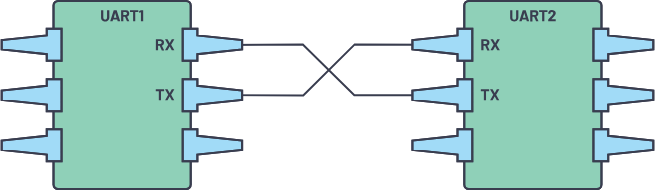
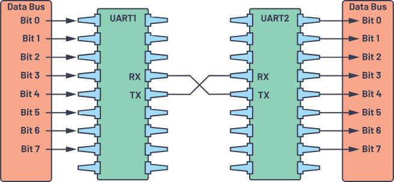
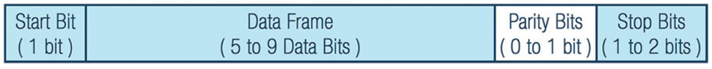
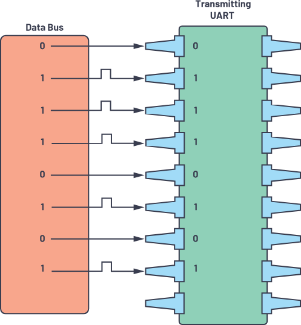
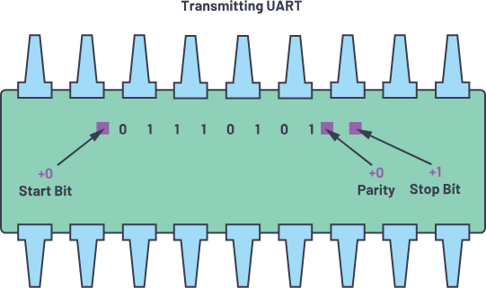
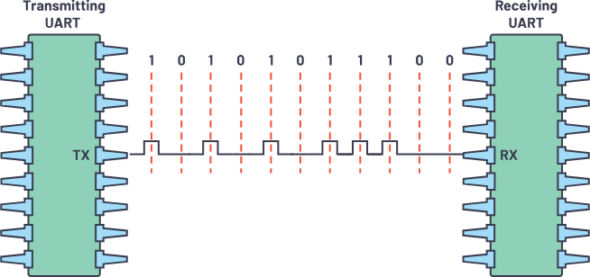
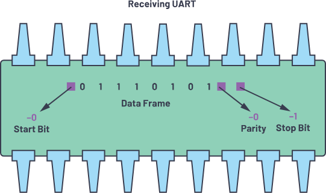
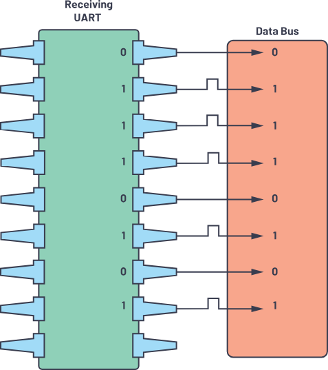
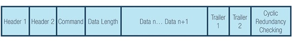
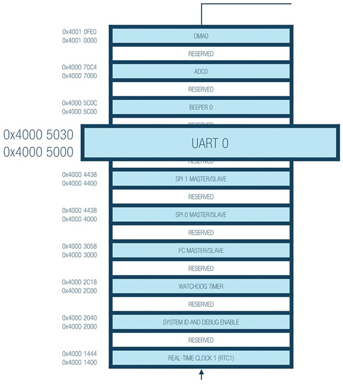

# UART (Universal Asynchronous Receiver-Transmitter)

## Table of Contents
- [Abstract](#abstract)
- [Interface](#interface)
- [Data Transmission](#data-transmission)
- [Steps of UART Transmission](#steps-of-uart-transmission)
- [Frame Protocol](#frame-protocol)
- [UART Operations](#uart-operations)
- [Why Is It Important?](#why-is-it-important)
- [Use Cases](#use-cases)
- [References](#references)

## Abstract
UART, or universal asynchronous receiver-transmitter, is one of the most used device-to-device communication protocols. This article shows how to use UART as a hardware communication protocol by following the standard procedure.

When properly configured, UART can work with many different types of serial protocols that involve transmitting and receiving serial data. In serial communication, data is transferred bit by bit using a single line or wire. In two-way communication, we use two wires for successful serial data transfer. Depending on the application and system requirements, serial communications needs less circuitry and wires, which reduces the cost of implementation.

we will discuss the fundamental principles when using UART, with a focus on packet transmission, standard frame protocol, and customized frame protocols that are value added features for security compliance when implemented, especially during code development. During product development, this document also aims to share some basic steps when checking on a data sheet for actual usage.

Communication protocol plays a big role in organizing communication between devices. It is designed in different ways based on system requirements, and these protocols have a specific rule agreed upon between devices to achieve successful communication.

Embedded systems, microcontrollers, and computers mostly use UART as a form of device-to-device hardware communication protocol. Among the available communication protocols, UART uses only two wires for its transmitting and receiving ends.

Despite being a widely used method of hardware communication protocol, it is not fully optimized all the time. Proper implementation of frame protocol is commonly disregarded when using the UART module inside the microcontroller.

By definition, UART is a hardware communication protocol that uses asynchronous serial communication with configurable speed. Asynchronous means there is no clock signal to synchronize the output bits from the transmitting device going to the receiving end.

## Interface

The two signals of each UART device are named:
- Transmitter (Tx)
- Receiver (Rx)

The main purpose of a transmitter and receiver line for each device is to transmit and receive serial data intended for serial communication.

The transmitting UART is connected to a controlling data bus that sends data in a parallel form. From this, the data will now be transmitted on the transmission line (wire) serially, bit by bit, to the receiving UART. This, in turn, will convert the serial data into parallel for the receiving device.

The UART lines serve as the communication medium to transmit and receive one data to another. Take note that a UART device has a transmit and receive pin dedicated for either transmitting or receiving.

For UART and most serial communications, the baud rate needs to be set the same on both the transmitting and receiving device. The baud rate is the rate at which information is transferred to a communication channel. In the serial port context, the set baud rate will serve as the maximum number of bits per second to be transferred.

Table 1 summarizes what we must know about UART.
|----------------------------|-----------------------------------------------------------------------------|
| Speed                      | 9600, 19200, 38400, 57600, 115200, 230400, 460800, 921600, 1000000, 1500000 |
| Methods of Transmission	 | Asynchronous                                                                |
| Maximum Number of Masters	 | 1                                                                           |
| Maximum Number of Slaves	 | 1                                                                           |
|----------------------------|-----------------------------------------------------------------------------|

The UART interface does not use a clock signal to synchronize the transmitter and receiver devices; it transmits data asynchronously. Instead of a clock signal, the transmitter generates a bitstream based on its clock signal while the receiver is using its internal clock signal to sample the incoming data. The point of synchronization is managed by having the same baud rate on both devices. Failure to do so may affect the timing of sending and receiving data that can cause discrepancies during data handling. The allowable difference of baud rate is up to 10% before the timing of bits gets too far off.

## Data Transmission

In UART, the mode of transmission is in the form of a packet. The piece that connects the transmitter and receiver includes the creation of serial packets and controls those physical hardware lines. A packet consists of a start bit, data frame, a parity bit, and stop bits.

### Start Bit
The UART data transmission line is normally held at a high voltage level when it’s not transmitting data. To start the transfer of data, the transmitting UART pulls the transmission line from high to low for one (1) clock cycle. When the receiving UART detects the high to low voltage transition, it begins reading the bits in the data frame at the frequency of the baud rate.

### Data Frame
The data frame contains the actual data being transferred. It can be five (5) bits up to eight (8) bits long if a parity bit is used. If no parity bit is used, the data frame can be nine (9) bits long. In most cases, the data is sent with the least significant bit first.

### Parity
Parity describes the evenness or oddness of a number. The parity bit is a way for the receiving UART to tell if any data has changed during transmission. Bits can be changed by electromagnetic radiation, mismatched baud rates, or long-distance data transfers.

After the receiving UART reads the data frame, it counts the number of bits with a value of 1 and checks if the total is an even or odd number. If the parity bit is a 0 (even parity), the 1 or logic-high bit in the data frame should total to an even number. If the parity bit is a 1 (odd parity), the 1 bit or logic highs in the data frame should total to an odd number.

When the parity bit matches the data, the UART knows that the transmission was free of errors. But if the parity bit is a 0, and the total is odd, or the parity bit is a 1, and the total is even, the UART knows that bits in the data frame have changed.

### Stop Bits
To signal the end of the data packet, the sending UART drives the data transmission line from a low voltage to a high voltage for one (1) to two (2) bit(s) duration.

## Steps of UART Transmission

**First:** The transmitting UART receives data in parallel from the data bus.

**Second:** The transmitting UART adds the start bit, parity bit, and the stop bit(s) to the data frame.

**Third:**  The entire packet is sent serially starting from start bit to stop bit from the transmitting   UART to the receiving UART. The receiving UART samples the data line at the preconfigured baud rate.

**Fourth:** The receiving UART discards the start bit, parity bit, and stop bit from the data frame.

**Fifth:** The receiving UART converts the serial data back into parallel and transfers it to the data bus on the receiving end.

## Frame Protocol

One key feature that is available in UART yet not fully used is the implementation of a frame protocol. The main use and importance of this is an added value for security and protection on each device.

For instance, when two devices use the same UART frame protocol, there are tendencies that, when connecting to the same UART without checking the configuration, the device will be connected to different pins that may cause malfunctions in the system.

On the other hand, implementing this ensures security because of the need to parse the information received in alignment with the design frame protocol. Each frame protocol is specifically designed to be unique and secure.

In designing a frame protocol, designers can set the desired headers and trailers, including CRC, to different devices. In Figure 13, two (2) bytes are set as part of the header.

Second: Under memory map, check the UART address.

Based on the sample, you can set a header, trailer, and CRC that are unique to your device.

Header 1 (H1 is 0xAB) and Header 2 (H2 is 0xCD)
Header is the unique identifier that determines if you are communicating with the correct device.

Command (CMD) Selection
Command will depend on the list of command designed to create the communication between two devices.

Data Length (DL) per Command
Data length will be based on the command chosen. You can maximize the length of data depending on the command chosen, so it can vary based on the selection. In that case, the data length can be adjusted.

Data n (Varying Data)
Data is the payload to be transferred from devices.

Trailer 1 (T1 is 0xE1) and Trailer 2 (T2 is 0xE2)
Trailers are data that are added after the transmission is ended. Just like the Header, they can be uniquely identified.

Cyclic Redundancy Checking (CRC Formula)
The cycling redundancy checking formula is an added error detecting mode to detect accidental changes to raw data. The CRC value of the transmitting device must always be equal to the CRC computations on the receiver’s end.

It is advisable to add security by implementing frame protocols for each UART device. The frame protocol needs identical configurations on both the transmitting and receiving devices.

## UART Operations

Third: Check the specific details for the UART PORT such as the operation mode, data bits length, the parity bit, and stop bits. Sample UART port details in data sheet: UART Port

The sample MCUs provide a full-duplex UART port, which is fully compatible with PC standard UARTs. The UART port provides a simplified UART interface to other peripherals or hosts, supporting full-duplex, DMA, and asynchronous transfer of serial data. The UART port includes support for five to eight data bits, and none, even, or odd parity. A frame is terminated by one and a half or two stop bits.

Fourth: Check the UART operation details, including the baud rate computation. Baud rate is configured using the following sample formula. This formula varies depending on the microcontroller.

Sample details of UART operations:

- 5 to 8 data bits
- 1, 2, or 1 and ½ stop bits
- None, or even or odd parity
- Programmable oversample rate by 4, 8, 16, 32
- Baud rate = PCLK/((M + N/2048) × 2OSR + 2 × DIV

where,

OSR (oversample rate)

UART_LCR2.OSR = 0 to 3

DIV (baud rate divider)

UART_DIV = 1 to 65535

M (DIVM fractional baud rate M)

UART_FBR.DIVM = 1 to 3

N (DIVM fractional baud rate M)

UART_FBR.DIVN = 0 to 2047

Fifth: For the baud rate, make sure to check what peripheral clock (PCLK) to use. In this example, there is a 26 MHz PCLK and 16 MHz PCLK available. Notice that OSR, DIV, DIVM, and DIVN varies per device.

Table 2. Baud Rate Example Based on 26 MHz PCLK
 Baud  Rate	 OSR	DIV    DIVM	
|---------------------------------|
 9600	 3	 24	    3  	   1078
 115200	 3	 4	    1	   1563

Table 3. Baud Rate Example Based on 16 MHz PCLK
  Baud  Rate   OSR	DIV    DIVM	
|---------------------------------|
  9600	  3	   17	3	   1078
  115200  3	   2	2	   348

Sixth: Next part is to check the detailed registers for UART Configuration. Take a look at the parameters in computing the baud rate such as UART_LCR2, UART_DIV, and UART_FBR. Table 4 will lead to a specific register to cover.

Table 4. UART Register Descriptions
  Name	      Description
|----------------------------------|
  UART_DIV	  Baud rate divider
  UART_FIBR	  Fractional baud rate
 UART_LCR2	  Second line control

Seventh: Under each register, check the details and substitute the values to compute for the baud rate, then start implementing the UART.

### Why Is It Important?
Familiarity with the UART communication protocol is advantageous when developing robust, quality-driven products. Knowing how to send data using only two wires, as well as how to transport a whole pack of data or a payload, will help ensure that data is transferred and received without error. Since UART is the most commonly used hardware communication protocol, this knowledge can enable design flexibility in future designs.

### Use Cases
You can use UART for many applications, such as:

Debugging: Early detection of system bugs is important during development. Adding UART can help in this scenario by capturing messages from the system.
Manufacturing function-level tracing: Logs are very important in manufacturing. They determine functionalities by alerting operators to what is happening on the manufacturing line.
Customer or client updates: Software updates are highly important. Having complete, dynamic hardware with update-capable software is important to having a complete system.
Testing/verification: Verifying products before they leave the manufacturing process helps deliver the best quality products possible to customers.

## References 
[UART: A Hardware Communication Protocol](https://www.analog.com/en/resources/analog-dialogue/articles/uart-a-hardware-communication-protocol.html)
